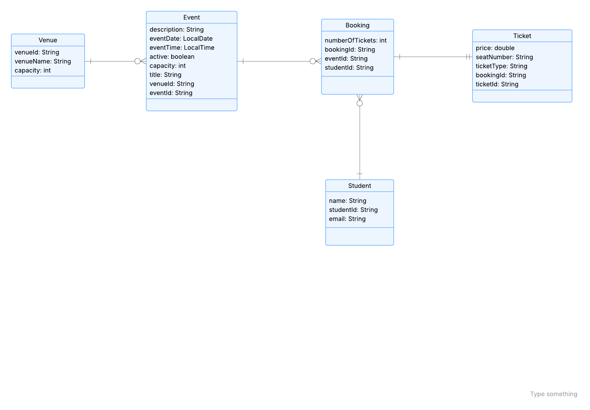

# Student Event System
 
## Description
This project is a Student Event System that allows students to view events, book tickets, and attend events. The university can create events, assign venues, and manage bookings.
The system is developed using Java and applies object-oriented design principles and design patterns.

## Group Members
* Jada – Booking
* Ayren – Student
* Milani – Event
* Angelia – Venue
* Nuyra – Ticket

## Entities
* Student
* Booking
* Event
* Venue
* Ticket

## Project Structure
* domain – contains entity classes
* factory – handles object creation
* repository – handles CRUD operations
* test – contains unit tests

## Design Patterns Used
* Builder Pattern
* Factory Pattern
* Repository Pattern
* Singleton Pattern

## Tools Used
* Java
* IntelliJ IDEA
* Maven
* GitHub
* JUnit 5

## How to Run
1. Clone the repository
2. Open in IntelliJ
3. Build using Maven
4. Run test classes

## Workflow
Each member worked on their own branch
Issues and milestones were used for task management
Pull requests were created for integration
